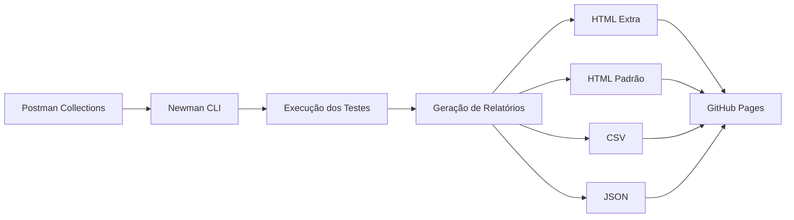

# 🎯 Testes de API com Postman e Newman

[](https://github.com/sthefanyricardo/testes-api-postman-newman/actions)
[](https://opensource.org/licenses/MIT)
[](https://nodejs.org)
[](https://www.postman.com/)

---

## 📝 Descrição

Este repositório demonstra a implementação completa de **testes automatizados de API** utilizando **Postman** e **Newman**, com integração contínua via **GitHub Actions** e deploy no **Github Pages**.

### Objetivo

O projeto foi desenvolvido como parte do curso "[Dominando Postman: Do Teste Manual a Performance APIs](https://www.udemy.com/course/dominando-postman-2023-testando-e-automatizado-apis)" na Udemy e no Qualiters Club, ministrado pela Priscila Caimi no Qualiters Club, e tem como objetivo:

- ✅ Demonstrar proficiência em **testes funcionais, automatizados e de performance** de APIs REST
- ✅ Automatizar a execução de testes utilizando **Newman CLI**
- ✅ Gerar **relatórios profissionais** com múltiplos formatos (HTML, HTML-EXTRA, CSV, JSON)
- ✅ Implementar **pipeline CI/CD** com GitHub Actions
- ✅ Publicar relatórios automaticamente no **GitHub Pages**

### API ServeRest

Este projeto utiliza a [**ServeRest API**](https://serverest.dev/), uma API REST gratuita que simula uma loja virtual, desenvolvida por [Paulo Gonçalves](https://github.com/PauloGoncalvesBH) para servir como material de estudos.

**Funcionalidades testadas:**
- 🔐 Autenticação e autorização de usuários
- 👤 Gerenciamento de usuários (CRUD)
- 📦 Gerenciamento de produtos (CRUD)
- 🛒 Operações de carrinho de compras 
- ✔️ Validação de contratos (json schema validation)
- 🔄 Testes de integração entre endpoints

---

## ⚙️ Estrutura do Repositório

O projeto está organizado para facilitar a navegação e execução:

```
testes-api-postman-newman/
│
├── .github/
│   └── workflows/
│       └── main.yml                              # Configuração do pipeline CI/CD (GitHub Actions).
│
├── collections/                                  # Arquivos de collection.json 
│   ├── serve_rest_adm.postman_collection.json    # Coleção de testes - Perfil Admin
│   └── serve_rest_user.postman_collection.json   # Coleção de testes - Perfil Usuário
│
├── environment/                                  # Arquivos .json com variáveis de ambiente (URLs).
│   └── serve_rest.postman_environment.json       # Variáveis de ambiente
│
└── README.md
```
---

## Fluxo de Testes



---

## ☁️ Automação (Pipeline CI/CD)Pipeline CI/CD

O pipeline é executado automaticamente em cada `push` ou `pull request` para a branch `main`:

1. **Setup**: Configuração do ambiente Node.js
2. **Install**: Instalação do Newman e reporters
3. **Test**: Execução das coleções de teste
   - Coleção ADM (administrador)
   - Coleção User (usuário padrão)
4. **Report**: Geração de múltiplos formatos de relatório
5. **Upload**: Armazenamento como artefatos do GitHub Actions
6. **Deploy**: Publicação automática no GitHub Pages (quando testes passam)

---

## 📦 Requisitos

### Requisitos de Sistema

- **Node.js**: v14.0.0 ou superior
- **NPM**: v6.0.0 ou superior
- **Sistema Operacional**: Windows, macOS ou Linux

### 🛠️ Tecnologias e Ferramentas

| Ferramenta | Versão Recomendada | Propósito |
|------------|-------------------|-----------|
| [Node.js](https://nodejs.org/) | ≥ 14.0.0 | Ambiente de execução e gerenciamento de dependências para Newman. |
| [Newman](https://www.npmjs.com/package/newman) | Latest | Executor de linha de comando para as coleções do Postman, incluindo a geração de relatorios. |
| [newman-reporter-htmlextra](https://www.npmjs.com/package/newman-reporter-htmlextra) | Latest | Geração de relatórios HTML detalhados e amigáveis. |
| [newman-reporter-html](https://www.npmjs.com/package/newman-reporter-html) | Latest | Geração de relatórios HTML padrão. |
| [newman-reporter-csv](https://www.npmjs.com/package/newman-reporter-csv) | Latest | Geração de relatórios em formato CSV |
| [Postman](https://www.postman.com/) | Latest | Criação e organização das coleções de requisições, variáveis de ambiente e scripts de teste (com JavaScript). |

---

## 🔧 Instalação

### 1. Clone o Repositório

```bash
git clone https://github.com/sthefanyricardo/testes-api-postman-newman.git
cd testes-api-postman-newman
```

### 2. Instale o Node.js

Baixe e instale a versão mais recente do Node.js em [nodejs.org](https://nodejs.org/).

Verifique a instalação:

```bash
node --version
npm --version
```

### 3. Instale o Newman e Reporters

### Instalação Global

```bash
npm install -g newman
npm install -g newman-reporter-htmlextra
npm install -g newman-reporter-html
npm install -g newman-reporter-csv
```

### Instalação Local

```bash
npm init -y
npm install newman newman-reporter-htmlextra newman-reporter-html newman-reporter-csv
```

### 4. Verifique a Instalação

```bash
newman --version
```

---

## ▶️ Como Executar

### Execução Local

### Executar Todas as Coleções

**Coleção ADM (Administrador):**

```bash
newman run collections/serve_rest_adm.postman_collection.json \
  -e environment/serve_rest.postman_environment.json \
  -r cli,htmlextra
```

**Coleção User (Usuário):**

```bash
newman run collections/serve_rest_user.postman_collection.json \
  -e environment/serve_rest.postman_environment.json \
  -r cli,htmlextra
```

### Executar com Múltiplos Relatórios

```bash
# Criar diretório para relatórios
mkdir -p newman_reports

# Executar com todos os reporters
newman run collections/serve_rest_adm.postman_collection.json \
  -e environment/serve_rest.postman_environment.json \
  -r cli,htmlextra,html,csv,json \
  --reporter-htmlextra-export newman_reports/report-adm-htmlextra.html \
  --reporter-html-export newman_reports/report-adm-html.html \
  --reporter-csv-export newman_reports/report-adm.csv \
  --reporter-json-export newman_reports/report-adm.json
```

### Executar com Opções Avançadas

```bash
# Com número de iterações
newman run collections/serve_rest_adm.postman_collection.json \
  -e environment/serve_rest.postman_environment.json \
  -n 3 \
  -r cli,htmlextra

# Com delay entre requisições (útil para rate limiting)
newman run collections/serve_rest_user.postman_collection.json \
  -e environment/serve_rest.postman_environment.json \
  --delay-request 1000 \
  -r cli,htmlextra

# Com timeout customizado
newman run collections/serve_rest_adm.postman_collection.json \
  -e environment/serve_rest.postman_environment.json \
  --timeout-request 10000 \
  -r cli,htmlextra
```

---

## Execução via GitHub Actions

### Automática

Os testes são executados automaticamente a cada `push` para a branch `main`.

### Manual

1. Acesse a aba **Actions** no GitHub
2. Selecione o workflow **"Run the test collection of the Serve REST API with newman"**
3. Clique em **"Run workflow"**
4. Selecione a branch desejada
5. Clique em **"Run workflow"**

---

## Visualizar Relatórios

### Relatórios Locais

Após a execução, abra os arquivos HTML no navegador:

```bash
# Linux/macOS
open newman_reports/report-adm-htmlextra.html

# Windows
start newman_reports/report-adm-htmlextra.html
```

### Relatórios do GitHub Actions

1. Acesse a aba **Actions**
2. Selecione a execução desejada
3. Na seção **Artifacts**, faça o download de **Reports**
4. Extraia o arquivo ZIP e abra os relatórios HTML

### GitHub Pages

Se os testes passarem, os relatórios são publicados automaticamente no GitHub Pages. Verifique a URL nos logs da execução ou acesse a seção **Environments** no repositório.

---

## 🙏 Agradecimentos

- **[Priscila Caimi](https://github.com/pricaimiTech)** - Instrutora do curso no Qualiters Club
- **[Paulo Gonçalves](https://github.com/PauloGoncalvesBH)** - Criador da ServeRest API
- **[ServeRest](https://github.com/ServeRest/ServeRest)** - API REST para estudos de testes

---

## 📞 Contato

**Sthefany Ricardo**

- GitHub: [@sthefanyricardo](https://github.com/sthefanyricardo)
- Linkedin: [@sthefanyricardo](https://www.linkedin.com/in/sthefanyricardo/)

---

## 🔗 Links Úteis

- [Documentação do Postman](https://learning.postman.com/docs/getting-started/introduction/)
- [Documentação do Newman](https://github.com/postmanlabs/newman)
- [GitHub Actions Documentation](https://docs.github.com/en/actions)
- [Curso na Udemy](https://www.udemy.com/course/dominando-postman-2023-testando-e-automatizado-apis)
- [Curso no Qualiters Club](https://priscilacaimi.com/estude-comigo/)
- [ServeRest API](https://serverest.dev)

---

<div align="center">

**⭐ Se você gostou deste projeto e/ou ele foi útil para você, considere dar uma estrela!**

**[⬆ Voltar ao topo](#-testes-de-api-com-postman-e-newman)**

</div>
