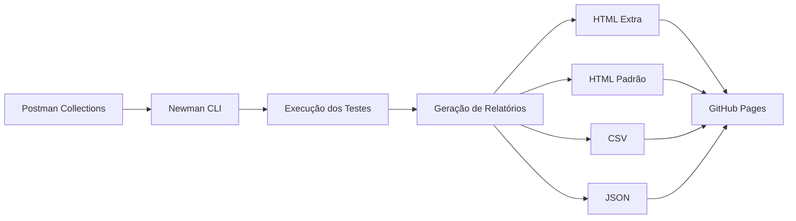

# 🚀 Testes de API com Postman e Newman

[](https://github.com/sthefanyricardo/testes-api-postman-newman/actions)
[](https://opensource.org/licenses/MIT)
[](https://nodejs.org)
[](https://www.postman.com/)

## 📋 Índice

- [Descrição](#-descrição)
- [Arquitetura](#-arquitetura)
- [Requisitos](#-requisitos)
- [Instalação](#-instalação)
- [Como Executar](#-como-executar)
- [Exemplos de Uso](#-exemplos-de-uso)
- [Boas Práticas](#-boas-práticas)
- [Como Contribuir](#-como-contribuir)
- [Licença](#-licença)

## 📝 Descrição

Este repositório demonstra a implementação completa de **testes automatizados de API** utilizando **Postman** e **Newman**, com integração contínua via **GitHub Actions**.

### Objetivo

O projeto foi desenvolvido como parte do curso "[Dominando Postman: Do Teste Manual a Performance APIs](https://www.udemy.com/course/dominando-postman-2023-testando-e-automatizado-apis)" da Udemy, ministrado pela Priscila Caimi no Qualiters Club, e tem como objetivo:

- ✅ Demonstrar proficiência em **testes funcionais, automatizados e de performance** de APIs REST
- ✅ Automatizar a execução de testes utilizando **Newman CLI**
- ✅ Gerar **relatórios profissionais** com múltiplos formatos (HTML, CSV, JSON)
- ✅ Implementar **pipeline CI/CD** com GitHub Actions
- ✅ Publicar relatórios automaticamente no **GitHub Pages**

### API Testada

Este projeto utiliza a [**ServeRest API**](https://serverest.dev), uma API REST gratuita que simula uma loja virtual, desenvolvida por [Paulo Gonçalves](https://github.com/PauloGoncalvesBH) para servir como material de estudos.

**Funcionalidades testadas:**
- 🔐 Autenticação e autorização de usuários
- 👤 Gerenciamento de usuários (CRUD)
- 📦 Gerenciamento de produtos
- 🛒 Operações de carrinho de compras
- ✔️ Validação de contratos (schema validation)
- 🔄 Testes de integração entre endpoints

## 🏗️ Arquitetura

### Estrutura do Projeto

```
testes-api-postman-newman/
│
├── .github/
│   └── workflows/
│       └── main.yml                    # Pipeline CI/CD (GitHub Actions)
│
├── collections/
│   ├── serve_rest_adm.postman_collection.json    # Coleção de testes - Perfil Admin
│   └── serve_rest_user.postman_collection.json   # Coleção de testes - Perfil Usuário
│
├── environment/
│   └── serve_rest.postman_environment.json       # Variáveis de ambiente
│
└── README.md
```

### Fluxo de Testes



### Pipeline CI/CD

O pipeline é executado automaticamente em cada `push` para a branch `main`:

1. **Setup**: Configuração do ambiente Node.js
2. **Install**: Instalação do Newman e reporters
3. **Test**: Execução das coleções de teste
   - Coleção ADM (administrador)
   - Coleção User (usuário padrão)
4. **Report**: Geração de múltiplos formatos de relatório
5. **Upload**: Armazenamento como artefatos do GitHub Actions
6. **Deploy**: Publicação automática no GitHub Pages (quando testes passam)

## 📦 Requisitos

### Requisitos de Sistema

- **Node.js**: v14.0.0 ou superior
- **NPM**: v6.0.0 ou superior
- **Sistema Operacional**: Windows, macOS ou Linux

### Ferramentas e Tecnologias

| Ferramenta | Versão Recomendada | Propósito |
|------------|-------------------|-----------|
| [Node.js](https://nodejs.org/) | ≥ 14.0.0 | Runtime JavaScript |
| [Newman](https://www.npmjs.com/package/newman) | Latest | Executor de coleções Postman via CLI |
| [newman-reporter-htmlextra](https://www.npmjs.com/package/newman-reporter-htmlextra) | Latest | Relatórios HTML detalhados |
| [newman-reporter-html](https://www.npmjs.com/package/newman-reporter-html) | Latest | Relatórios HTML padrão |
| [newman-reporter-csv](https://www.npmjs.com/package/newman-reporter-csv) | Latest | Relatórios em formato CSV |
| [Postman](https://www.postman.com/) (Opcional) | Latest | Edição e visualização de coleções |

## 🔧 Instalação

### 1. Clone o Repositório

```bash
git clone https://github.com/sthefanyricardo/testes-api-postman-newman.git
cd testes-api-postman-newman
```

### 2. Instale o Node.js

Baixe e instale a versão mais recente do Node.js em [nodejs.org](https://nodejs.org/).

Verifique a instalação:

```bash
node --version
npm --version
```

### 3. Instale o Newman e Reporters

#### Instalação Global (Recomendado)

```bash
npm install -g newman
npm install -g newman-reporter-htmlextra
npm install -g newman-reporter-html
npm install -g newman-reporter-csv
```

#### Instalação Local (Opcional)

```bash
npm init -y
npm install newman newman-reporter-htmlextra newman-reporter-html newman-reporter-csv
```

### 4. Verifique a Instalação

```bash
newman --version
```

## ▶️ Como Executar

### Execução Local

#### Executar Todas as Coleções

**Coleção ADM (Administrador):**

```bash
newman run collections/serve_rest_adm.postman_collection.json \
  -e environment/serve_rest.postman_environment.json \
  -r cli,htmlextra
```

**Coleção User (Usuário):**

```bash
newman run collections/serve_rest_user.postman_collection.json \
  -e environment/serve_rest.postman_environment.json \
  -r cli,htmlextra
```

#### Executar com Múltiplos Relatórios

```bash
# Criar diretório para relatórios
mkdir -p newman_reports

# Executar com todos os reporters
newman run collections/serve_rest_adm.postman_collection.json \
  -e environment/serve_rest.postman_environment.json \
  -r cli,htmlextra,html,csv,json \
  --reporter-htmlextra-export newman_reports/report-adm-htmlextra.html \
  --reporter-html-export newman_reports/report-adm-html.html \
  --reporter-csv-export newman_reports/report-adm.csv \
  --reporter-json-export newman_reports/report-adm.json
```

#### Executar com Opções Avançadas

```bash
# Com número de iterações
newman run collections/serve_rest_adm.postman_collection.json \
  -e environment/serve_rest.postman_environment.json \
  -n 3 \
  -r cli,htmlextra

# Com delay entre requisições (útil para rate limiting)
newman run collections/serve_rest_user.postman_collection.json \
  -e environment/serve_rest.postman_environment.json \
  --delay-request 1000 \
  -r cli,htmlextra

# Com timeout customizado
newman run collections/serve_rest_adm.postman_collection.json \
  -e environment/serve_rest.postman_environment.json \
  --timeout-request 10000 \
  -r cli,htmlextra
```

### Execução via GitHub Actions

#### Automática

Os testes são executados automaticamente a cada `push` para a branch `main`.

#### Manual

1. Acesse a aba **Actions** no GitHub
2. Selecione o workflow **"Run the test collection of the Serve REST API with newman"**
3. Clique em **"Run workflow"**
4. Selecione a branch desejada
5. Clique em **"Run workflow"**

### Visualizar Relatórios

#### Relatórios Locais

Após a execução, abra os arquivos HTML no navegador:

```bash
# Linux/macOS
open newman_reports/report-adm-htmlextra.html

# Windows
start newman_reports/report-adm-htmlextra.html
```

#### Relatórios do GitHub Actions

1. Acesse a aba **Actions**
2. Selecione a execução desejada
3. Na seção **Artifacts**, faça o download de **Reports**
4. Extraia o arquivo ZIP e abra os relatórios HTML

#### GitHub Pages

Se os testes passarem, os relatórios são publicados automaticamente no GitHub Pages. Verifique a URL nos logs da execução ou acesse a seção **Environments** no repositório.

## 💡 Exemplos de Uso

### Exemplo 1: Teste de Criação de Usuário

```javascript
// Trecho do script de teste Postman
pm.test("Status code is 201", function () {
    pm.response.to.have.status(201);
});

pm.test("Usuário criado com sucesso", function () {
    var jsonData = pm.response.json();
    pm.expect(jsonData.message).to.eql("Cadastro realizado com sucesso");
    pm.expect(jsonData._id).to.exist;
});

// Salvar ID do usuário para uso posterior
pm.environment.set("userId", pm.response.json()._id);
```

### Exemplo 2: Validação de Schema

```javascript
// Validação de contrato usando AJV
const Ajv = require('ajv');
const ajv = new Ajv();

const schema = {
    "type": "object",
    "properties": {
        "nome": { "type": "string" },
        "email": { "type": "string" },
        "password": { "type": "string" },
        "administrador": { "type": "string" }
    },
    "required": ["nome", "email", "password", "administrador"]
};

pm.test("Schema válido", function () {
    var jsonData = pm.response.json();
    var valid = ajv.validate(schema, jsonData);
    pm.expect(valid).to.be.true;
});
```

### Exemplo 3: Teste de Autenticação

```javascript
// Teste de login bem-sucedido
pm.test("Login realizado com sucesso", function () {
    pm.response.to.have.status(200);
    var jsonData = pm.response.json();
    pm.expect(jsonData.message).to.eql("Login realizado com sucesso");
    pm.expect(jsonData.authorization).to.exist;
});

// Salvar token de autenticação
pm.environment.set("authToken", pm.response.json().authorization);
```

### Exemplo 4: Teste de Performance

```javascript
// Validar tempo de resposta
pm.test("Response time is less than 500ms", function () {
    pm.expect(pm.response.responseTime).to.be.below(500);
});

// Validar tamanho da resposta
pm.test("Response size is less than 1KB", function () {
    pm.expect(pm.response.responseSize).to.be.below(1024);
});
```

### Exemplo 5: Uso de Variáveis de Ambiente

**Arquivo: `environment/serve_rest.postman_environment.json`**

```json
{
  "values": [
    {
      "key": "baseUrl",
      "value": "https://serverest.dev",
      "enabled": true
    }
  ]
}
```

**Uso na coleção:**

```
URL: {{baseUrl}}/usuarios
```

## 📚 Boas Práticas

### Organização de Coleções

1. **Separação por Perfil**: Mantenha coleções separadas para diferentes perfis de usuário (Admin, User)
2. **Nomenclatura Clara**: Use nomes descritivos para requisições e pastas
3. **Reutilização**: Utilize variáveis de ambiente e globais para evitar duplicação

### Escrita de Testes

1. **Testes Independentes**: Cada teste deve ser independente e não depender da ordem de execução
2. **Asserções Específicas**: Faça asserções claras e específicas
3. **Mensagens Descritivas**: Use mensagens de teste que descrevam o comportamento esperado

```javascript
// ❌ Evite
pm.test("Test 1", function () {
    pm.response.to.have.status(200);
});

// ✅ Prefira
pm.test("Deve retornar status 200 ao listar usuários com sucesso", function () {
    pm.response.to.have.status(200);
});
```

### Gerenciamento de Dados

1. **Dados Dinâmicos**: Use bibliotecas como `faker.js` ou APIs de geração de dados
2. **Limpeza**: Implemente scripts de limpeza após os testes
3. **Massa de Dados**: Mantenha scripts de geração de massa de dados quando necessário

### Validação

1. **Status Code**: Sempre valide o código de status HTTP
2. **Schema**: Valide a estrutura da resposta (schema validation)
3. **Conteúdo**: Valide valores específicos quando relevante
4. **Performance**: Adicione testes de tempo de resposta

### CI/CD

1. **Execução Regular**: Configure o pipeline para executar em cada push
2. **Notificações**: Configure notificações para falhas de teste
3. **Artefatos**: Mantenha os relatórios como artefatos para análise posterior
4. **Versionamento**: Versione as coleções e ambientes junto com o código

### Segurança

1. **Sem Credenciais**: Nunca commite credenciais ou tokens no repositório
2. **Secrets**: Use GitHub Secrets para informações sensíveis
3. **Ambiente**: Utilize variáveis de ambiente para configurações sensíveis

## 🤝 Como Contribuir

Contribuições são bem-vindas! Este projeto segue as melhores práticas de código aberto.

### Processo de Contribuição

1. **Fork o Projeto**

```bash
# Clique no botão "Fork" no GitHub
```

2. **Clone seu Fork**

```bash
git clone https://github.com/SEU_USUARIO/testes-api-postman-newman.git
cd testes-api-postman-newman
```

3. **Crie uma Branch para sua Feature**

```bash
git checkout -b feature/minha-nova-feature
```

4. **Faça suas Alterações**

- Adicione novos testes
- Melhore testes existentes
- Atualize documentação
- Corrija bugs

5. **Commit suas Alterações**

```bash
git add .
git commit -m "feat: adiciona testes para endpoint de produtos"
```

**Convenções de Commit:**

- `feat`: Nova funcionalidade
- `fix`: Correção de bug
- `docs`: Alterações na documentação
- `test`: Adição ou modificação de testes
- `refactor`: Refatoração de código
- `style`: Alterações de formatação
- `chore`: Tarefas de manutenção

6. **Push para o GitHub**

```bash
git push origin feature/minha-nova-feature
```

7. **Abra um Pull Request**

- Acesse seu fork no GitHub
- Clique em "New Pull Request"
- Descreva suas alterações
- Aguarde o review

### Diretrizes

- ✅ Siga as convenções de nomenclatura existentes
- ✅ Adicione testes para novas funcionalidades
- ✅ Atualize a documentação quando necessário
- ✅ Certifique-se de que os testes passam antes de submeter o PR
- ✅ Mantenha as descrições de commit claras e concisas

### Reportar Issues

Encontrou um bug ou tem uma sugestão?

1. Verifique se já não existe uma issue similar
2. Abra uma nova issue com:
   - Descrição clara do problema ou sugestão
   - Passos para reproduzir (se bug)
   - Comportamento esperado vs atual
   - Screenshots, se aplicável
   - Ambiente (SO, versão do Node.js, etc.)

## 📄 Licença

Este projeto está licenciado sob a **MIT License** - veja o arquivo [LICENSE](LICENSE) para mais detalhes.

### MIT License

```
MIT License

Copyright (c) 2025 Sthefany Ricardo

Permission is hereby granted, free of charge, to any person obtaining a copy
of this software and associated documentation files (the "Software"), to deal
in the Software without restriction, including without limitation the rights
to use, copy, modify, merge, publish, distribute, sublicense, and/or sell
copies of the Software, and to permit persons to whom the Software is
furnished to do so, subject to the following conditions:

The above copyright notice and this permission notice shall be included in all
copies or substantial portions of the Software.

THE SOFTWARE IS PROVIDED "AS IS", WITHOUT WARRANTY OF ANY KIND, EXPRESS OR
IMPLIED, INCLUDING BUT NOT LIMITED TO THE WARRANTIES OF MERCHANTABILITY,
FITNESS FOR A PARTICULAR PURPOSE AND NONINFRINGEMENT. IN NO EVENT SHALL THE
AUTHORS OR COPYRIGHT HOLDERS BE LIABLE FOR ANY CLAIM, DAMAGES OR OTHER
LIABILITY, WHETHER IN AN ACTION OF CONTRACT, TORT OR OTHERWISE, ARISING FROM,
OUT OF OR IN CONNECTION WITH THE SOFTWARE OR THE USE OR OTHER DEALINGS IN THE
SOFTWARE.
```

---

## 🙏 Agradecimentos

- **[Priscila Caimi](https://www.linkedin.com/in/priscilacaimi/)** - Instrutora do curso no Qualiters Club
- **[Paulo Gonçalves](https://github.com/PauloGoncalvesBH)** - Criador da ServeRest API
- **[ServeRest](https://github.com/ServeRest/ServeRest)** - API REST para estudos de testes

---

## 📞 Contato

**Sthefany Ricardo**

- GitHub: [@sthefanyricardo](https://github.com/sthefanyricardo)
- Repositório: [testes-api-postman-newman](https://github.com/sthefanyricardo/testes-api-postman-newman)

---

## 🔗 Links Úteis

- [Documentação do Postman](https://learning.postman.com/docs/getting-started/introduction/)
- [Documentação do Newman](https://github.com/postmanlabs/newman)
- [ServeRest API](https://serverest.dev)
- [GitHub Actions Documentation](https://docs.github.com/en/actions)
- [Curso na Udemy](https://www.udemy.com/course/dominando-postman-2023-testando-e-automatizado-apis)

---

<div align="center">

**⭐ Se este projeto foi útil para você, considere dar uma estrela!**

**[⬆ Voltar ao topo](#-testes-de-api-com-postman-e-newman)**

</div>
