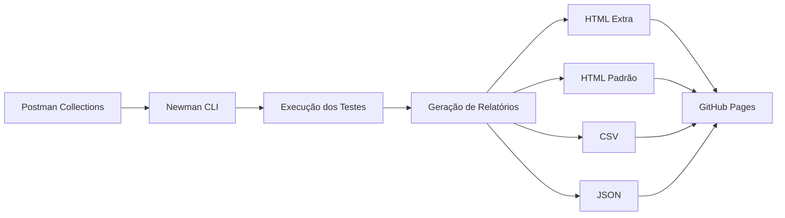
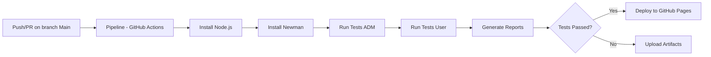

<div align="center">

<h1>🏆 Testes de API com Postman e Newman</h1>

<!-- Badges de Tecnologias -->
[](https://nodejs.org)
[](https://npmjs.com)
[](https://www.postman.com/)
[](https://github.com/postmanlabs/newman)

<!-- Badges de Status do Projeto -->
[](https://github.com/sthefanyricardo/testes-api-postman-newman/actions)
[](https://sthefanyricardo.github.io/testes-api-postman-newman/)
[](https://github.com/sthefanyricardo/testes-api-postman-newman/issues)
[](https://github.com/sthefanyricardo/testes-api-postman-newman/pulls)
<!-- Badge de Última Atualização -->
[](https://github.com/sthefanyricardo/testes-api-postman-newman/commits/main)

<!-- Badges de Métricas (Opcionais) -->
[](https://github.com/sthefanyricardo/testes-api-postman-newman/stargazers)
[](https://github.com/sthefanyricardo/testes-api-postman-newman/network/members)
[](https://github.com/sthefanyricardo/testes-api-postman-newman/watchers)

</div>

---
## 📋 Índice

- [Sobre o Projeto](#-sobre-o-projeto)
- [Funcionalidades](#-funcionalidades)
- [Tecnologias e Ferramentas](#️-tecnologias-e-ferramentas)
- [Estrutura do Projeto](#-estrutura-do-projeto)
- [Cobertura de Testes](#-cobertura-de-testes)
- [Cobertura de Testes Detalhada](docs/test-coverage.md)
- [Cobertura de Testes Resumo Executivo](docs/test-coverage-summary.md)
- [Roadmap](#️-roadmap)
- [Pipeline CI/CD](#️-pipeline-cicd)
- [Pré-requisitos](#-pré-requisitos)
- [Instalação](#-instalação)
- [Como Executar](#️-como-executar)
- [Relatórios](#-relatórios)
- [Contribuindo](#-contribuindo)
- [Agradecimentos](#-agradecimentos)
- [Contato](#-contato)
- [Links Úteis](#-links-úteis)

---

## 🎓 Sobre o Projeto

Este repositório demonstra a implementação completa de **testes automatizados de API** utilizando **Postman** e **Newman**, com integração contínua via **GitHub Actions** e deploy no **Github Pages**.

### 📝 Objetivo

O projeto foi desenvolvido como parte do curso "[Dominando Postman: Do Teste Manual a Performance APIs](https://www.udemy.com/course/dominando-postman-2023-testando-e-automatizado-apis)" na Udemy e no Qualiters Club, ministrado pela Priscila Caimi, e tem como objetivo:

- ✅ Demonstrar proficiência em **testes funcionais, automatizados e de performance** de APIs REST
- ✅ Automatizar a execução de testes utilizando **Newman CLI**
- ✅ Gerar **relatórios profissionais** com múltiplos formatos (HTML, HTML-EXTRA, CSV, JSON)
- ✅ Implementar **pipeline CI/CD** com GitHub Actions
- ✅ Publicar relatórios automaticamente no **GitHub Pages**
- ✅ Aplicar boas práticas de QA e DevOps

### 🧠 API ServeRest

Este projeto utiliza a [**ServeRest API**](https://serverest.dev/), uma API REST gratuita que simula uma loja virtual, desenvolvida por [Paulo Gonçalves](https://github.com/PauloGoncalvesBH) especificamente para servir como material de estudos em testes de API.

#### Endpoints testados:
- 🔐 `/login` - Autenticação e autorização de usuários
- 👤 `/usuarios` e `/usuarios/{_id}` - Gerenciamento de usuários (CRUD)
- 📦 `/produtos` e `/produtos/{_id}` - Gerenciamento de produtos (CRUD)
- 🛒 `/carrinhos`, `/carrinhos/{_id}`, `/carrinhos/concluir-compra` e `/carrinhos/cancelar-compra` - Operações de carrinho de compras 

---

## ✨ Funcionalidades

### Tipos de Testes Implementados

- **Testes Funcionais**: Validação de endpoints, status codes, headers e payloads
- **Testes de Contrato**: Validação de JSON schema com a biblioteca Ajv
- **Testes Negativos**: Validação de cenários de erro e edge cases
- **Testes de Segurança**: Validação de autenticação e autorização (Admin vs User)
- **Testes de Integração**: Fluxos completos entre múltiplos endpoints
- **Testes de Performance**: Medição e validação de tempo de resposta

### Recursos Técnicos

- 🔄 **Automação Completa**: Execução via CLI e CI/CD
- 📊 **Múltiplos Formatos de Relatório**: HTML, HTML Extra, CSV, JSON
- 🌐 **Deploy Automático**: Publicação de relatórios no GitHub Pages
- 🔍 **Variáveis de Ambiente**: Gestão de configurações por ambiente
- 📝 **Documentação Viva**: Collections como documentação executável
- 🔒 **Testes de Permissão**: Validação de rotas exclusivas para administradores

---

## 🛠️ Tecnologias e Ferramentas

### Principais

| Ferramenta | Versão | Propósito |
|------------|-------------------|-----------|
| [Node.js](https://nodejs.org/) | ≥14.0.0 | Ambiente de execução e gerenciamento de dependências para Newman. |
| [Newman](https://www.npmjs.com/package/newman) | Latest | Executor de linha de comando para as coleções do Postman, incluindo a geração de relatorios. |
| [Postman](https://www.postman.com/) | Latest | Criação e organização das coleções de requisições, variáveis de ambiente e scripts de teste (com JavaScript). |
| [GitHub Actions](https://github.com/features/actions) | - | Pipelines de CI/CD |

### Reports / Relatórios
| Ferramenta | Versão | Propósito |
|------------|-------------------|-----------|
| [newman-reporter-htmlextra](https://www.npmjs.com/package/newman-reporter-htmlextra) | Latest | Geração de relatórios HTML detalhados e amigáveis. |
| [newman-reporter-html](https://www.npmjs.com/package/newman-reporter-html) | Latest | Geração de relatórios HTML padrão. |
| [newman-reporter-csv](https://www.npmjs.com/package/newman-reporter-csv) | Latest | Geração de relatórios em formato CSV |

### Collections do Postman

Acesse o workspace público com todas as coleções: [**Postman Workspace**](https://web.postman.co/workspace/bd80135c-7abe-4289-a106-935b4fb06bb9)

---

## 📁 Estrutura do Projeto

O projeto está organizado para facilitar a navegação e execução:

```
testes-api-postman-newman/
│
├── .github/
│   └── workflows/
│       └── main.yml                              # Configuração do pipeline CI/CD (GitHub Actions).
│   └── templates/
│       └── index.html                              # Template da página index para GitHub Pages
│
├── collections/                                  # Coleções do Postman - Arquivos de collection*.json 
│   ├── serve_rest_adm.postman_collection.json    # Coleção de testes - Perfil Admin
│   └── serve_rest_user.postman_collection.json   # Coleção de testes - Perfil Usuário
│
├── environment/                                  # Arquivos .json com variáveis de ambiente (URLs)
│   └── serve_rest.postman_environment.json       # Configurações de ambiente
│
├── docs/                                        # Cobertura de Testes - Relatórios completos
│   └── test-coverage.md                         # Cobertura Detalhada de Testes
│   └── test-coverage-summary.md                 # Resumo Executivo da Cobertura
│
└── README.md                                     # Este arquivo
```
---

## 📊 Cobertura de Testes

### 👩‍💻 Coleção API ServeRest ADM

| Endpoint | Métodos | Cenários | Testes |
|----------|---------|----------|--------|
| `/login` | POST | Login com credenciais de admin | 6 |
| `/usuarios` | GET, POST | Listagem de usuários, Cadastro de admin e usuário auxiliar | 10 |
| `/usuarios/{_id}` | GET, PUT, DELETE | Busca por ID, Edição de usuário auxiliar, Exclusão de usuário auxiliar | 13 |
| `/produtos` | GET, POST | Listagem de produtos, Cadastro de 2 produtos (autorizado) | 17 |
| `/produtos/{_id}` | GET, PUT, DELETE | Busca de 2 produtos específicos, Edição de produto (autorizado), Exclusão de produto (autorizado) | 20 |
| `/carrinhos` | GET, POST | Listagem de carrinhos ativos e Criação de carrinho | 18 |
| `/carrinhos/{_id}` | GET | Busca de carrinho específico com validação de cálculos | 14 |
| `/carrinhos/concluir-compra` | DELETE | Tentativa de conclusão após cancelamento | 8 |
| `/carrinhos/cancelar-compra` | DELETE | Cancelamento com reabastecimento de estoque | 8 |

📈 **Total: 20 requisições | 104 testes executados | 127 assertions**

---

### 👤 Coleção API ServeRest User

| Endpoint | Métodos | Cenários | Testes |
|----------|---------|----------|--------|
| `/login` | POST | Login com credenciais de usuário comum | 6 |
| `/usuarios` | GET, POST | Listagem de usuários, Cadastro de user e usuário auxiliar | 10 |
| `/usuarios/{_id}` | GET, PUT, DELETE | Busca por ID, Edição de usuário auxiliar, Exclusão de usuário auxiliar | 13 |
| `/produtos` | GET, POST | Listagem de produtos, **Tentativa de cadastro (403 Forbidden)** | 11 |
| `/produtos/{_id}` | GET, PUT, DELETE | Busca de produto específico, **Tentativa de edição (403 Forbidden)**, **Tentativa de exclusão (403 Forbidden)** | 22 |
| `/carrinhos` | GET, POST | Listagem de carrinhos ativos e Criação de carrinho | 18 |
| `/carrinhos/{_id}` | GET | Busca de carrinho específico com validação de cálculos | 14 |
| `/carrinhos/concluir-compra` | DELETE | Tentativa de conclusão após cancelamento | 8 |
| `/carrinhos/cancelar-compra` | DELETE | Cancelamento com reabastecimento de estoque | 8 |

📈 **Total: 18 requisições | 92 testes executados | 113 assertions**

---

### 🚦 Tipos de Validações

- ✅ **Status codes**: 200, 201, 400, 401, 403, 404, etc.
- ✅ **Headers**: Authorization, Content-Type, Accept, etc.
- ✅ **Estrutura do corpo de resposta**: Validação de campos obrigatórios
- ✅ **Validação de JSON Schema**: Conformidade com contratos definidos
- ✅ **Validação de lógica de negócios**: Regras específicas da aplicação
- ✅ **Dados retornados**: Precisão dos valores nas respostas
- ✅ **Mensagens de sucesso**: Feedback correto em operações bem-sucedidas
- ✅ **Mensagens de erro**: Validação de mensagens em cenários de falha
- ✅ **Tempo de resposta**: Performance dos endpoints

---

### 🚩 Destaques da Cobertura

**Métricas Consolidadas:**
- 📊 **38 requisições totais** (20 Admin + 18 User)
- ✅ **196 testes executados** (104 Admin + 92 User)
- ✅ **240 assertions totais** (127 Admin + 113 User)
- 🎯 **100% de taxa de sucesso** em ambas as collections

**Diferenças entre Perfis:**
- ✅ **Admin**: Autorizado para POST, PUT, DELETE em `/produtos` (Status 200/201)
- ❌ **User**: Bloqueado para POST, PUT, DELETE em `/produtos` (Status 403 - "Rota exclusiva para administradores")
- 🔒 **6 cenários de autorização** validados com sucesso

---

## 🗺️ Roadmap

### ✅ Concluído

- [x] Cobertura completa de endpoints nas Collections do Postman
- [x] Múltiplos formatos de relatório com o Newman
- [x] Pipeline CI/CD com GitHub Actions
- [x] Deploy automático no GitHub Pages

### 🚧 Em Desenvolvimento

- [ ] Desenvolvimento de testes automatizados de API com o Robot Framework
- [ ] Cobertura completa dos testes cenários positivos, negativos e alternativos com o Robot Framework
- [ ] Testes de contrato com validação de JSON Schema no Robot Framework

### 📅 Planejado

- [ ] Testes de carga e stress com K6
- [ ] Integração com ferramentas de monitoramento
- [ ] Dashboard de métricas em tempo real
- [ ] Testes de segurança com OWASP ZAP
- [ ] Testes de contrato com Pact ou Python

--- 

## ☁️ Pipeline CI/CD

O arquivo `.github/workflows/main.yml` contém toda a configuração do pipeline. O pipeline é executado automaticamente em cada `push` ou `pull request` para a branch `main`. 

### 🔄 Etapas do Pipeline
1. **Setup**: Configuração do ambiente Node.js
2. **Install**: Instalação do Newman e reports necessários
3. **Test**: Execução sequencial das coleções de teste
   - Coleção ADM (perfil administrador)
   - Coleção User (perfil usuário padrão)
4. **Report**: Geração de múltiplos formatos de relatório (HTML-EXTRA, HTML, CSV, JSON)
5. **Upload**: Armazenamento como artefatos do GitHub Actions (sempre executado)
6. **Deploy**: Publicação automática no GitHub Pages (apenas quando testes passam)
   
### Fluxo de Execução dos Testes


### Fluxo de Execução do Pipeline de CI/CD


---

## 📦 Pré-requisitos

### Requisitos de Sistema

- **Sistema Operacional**: Windows, macOS ou Linux
- **Node.js**: v14.0.0 ou superior ([Download Node.js](https://nodejs.org/))
- **npm**: v6.0.0 ou superior (incluído com Node.js)
- **Git**: Para clonar o repositório ([Download Git](https://git-scm.com/))

#### Verificar Instalações:
```bash
# Verificar Node.js
node --version

# Verificar npm
npm --version

# Verificar Git
git --version
```

#### Saídas esperadas:
```
node v14.x.x (ou superior)
npm v6.x.x (ou superior)
git version 2.x.x (ou superior)
```

---

## 🔧 Instalação

### 1️⃣ Clone o Repositório

```bash
# Clonar via HTTPS
git clone https://github.com/sthefanyricardo/testes-api-postman-newman.git

# OU clonar via SSH
git clone git@github.com:sthefanyricardo/testes-api-postman-newman.git

# Entrar no diretório
cd testes-api-postman-newman
```

### 2️⃣ Instale o Node.js

Baixe e instale a versão LTS mais recente do Node.js em [nodejs.org](https://nodejs.org/).

Verifique a instalação:

```bash
node --version
npm --version
```

### 3️⃣ Instale o Newman e Reports

#### Opção A: Instalação Global

```bash
# Instalar Newman
npm install -g newman

# Instalar Reports
npm install -g newman-reporter-htmlextra
npm install -g newman-reporter-html
npm install -g newman-reporter-csv
```

#### Opção B: Instalação Local

```bash
# Inicializar projeto
npm init -y

# Instalar Newman e Reports
npm install newman newman-reporter-htmlextra newman-reporter-html newman-reporter-csv --save-dev
```

### 4️⃣ Verifique a Instalação

```bash
newman --version
```

**Saída esperada**: `newman/6.x.x` ou superior

---

## ▶️ Como Executar

### 🖥️ Execução Local

#### Executar coleção individual

**Coleção ADM (Administrador):**

```bash
newman run collections/serve_rest_adm.postman_collection.json \
  -e environment/serve_rest.postman_environment.json \
  -r cli,htmlextra
```

**Coleção User (Usuário):**

```bash
newman run collections/serve_rest_user.postman_collection.json \
  -e environment/serve_rest.postman_environment.json \
  -r cli,htmlextra
```

#### Executar com geração de múltiplos relatórios

```bash
# Criar diretório para relatórios
mkdir -p newman_reports

# Executar coleção ADM com todos os reports
newman run collections/serve_rest_adm.postman_collection.json \
  -e environment/serve_rest.postman_environment.json \
  -r cli,htmlextra,html,csv,json \
  --reporter-htmlextra-export newman_reports/report-adm-htmlextra.html \
  --reporter-html-export newman_reports/report-adm-html.html \
  --reporter-csv-export newman_reports/report-adm.csv \
  --reporter-json-export newman_reports/report-adm.json

# Executar coleção User com todos os reports
newman run collections/serve_rest_user.postman_collection.json \
  -e environment/serve_rest.postman_environment.json \
  -r cli,htmlextra,html,csv,json \
  --reporter-htmlextra-export newman_reports/report-user-htmlextra.html \
  --reporter-html-export newman_reports/report-user-html.html \
  --reporter-csv-export newman_reports/report-user.csv \
  --reporter-json-export newman_reports/report-user.json
```

#### Executar com opções avançadas

```bash
# Com múltiplas iterações (executar 3 vezes)
newman run collections/serve_rest_adm.postman_collection.json \
  -e environment/serve_rest.postman_environment.json \
  -n 3 \
  -r cli,htmlextra

# Com delay entre requisições (útil para rate limiting)
newman run collections/serve_rest_user.postman_collection.json \
  -e environment/serve_rest.postman_environment.json \
  --delay-request 1000 \
  -r cli,htmlextra

# Com timeout customizado (10 segundos)
newman run collections/serve_rest_adm.postman_collection.json \
  -e environment/serve_rest.postman_environment.json \
  --timeout-request 10000 \
  -r cli,htmlextra

# Modo verbose (debug detalhado)
newman run collections/serve_rest_adm.postman_collection.json \
  -e environment/serve_rest.postman_environment.json \
  --verbose
```

---

### ☁️ Execução via GitHub Actions

#### 🤖 Execução automática

Os testes são executados automaticamente em cada:
- **Push** para a branch `main`
- **Pull Request** para a branch `main`

#### 🔧 Execução manual

1. Acesse a aba **Actions** no repositório do GitHub
2. Selecione o workflow **"Run the test collection of the Serve REST API with newman"**
3. Clique em **"Run workflow"**
4. Selecione a branch desejada (padrão: `main`)
5. Clique em **"Run workflow"** novamente para confirmar

---

## 📊 Relatórios

### 📋 Tipos de Relatórios

| Formato | Descrição | Uso Recomendado |
|---------|-----------|-----------------|
| **HTML Extra** | Relatório detalhado e interativo com gráficos | Análise visual completa e apresentações |
| **HTML** | Relatório padrão em HTML | Documentação e arquivamento simples |
| **CSV** | Dados tabulares exportáveis | Análise quantitativa em Excel/Sheets |
| **JSON** | Dados estruturados em formato JSON | Integração com outras ferramentas |

### 🔍 Visualizar Relatórios

#### Relatórios Locais

Após a execução local, abra os arquivos HTML no navegador:

```bash
# Linux/macOS
open newman_reports/report-adm-htmlextra.html

# Windows
start newman_reports/report-adm-htmlextra.html
```

#### Relatórios do GitHub Actions

1. Acesse a aba **Actions** no repositório
2. Selecione a execução desejada
3. Na seção **Artifacts**, faça o download de **Reports**
4. Extraia o arquivo ZIP e abra os relatórios HTML
5. **OU** verifique o step `deploy-github-pages` que contém a URL do GitHub Pages

#### GitHub Pages

Se os testes passarem, os relatórios são publicados automaticamente. Para acessar:

**Opção 1**: Acesse diretamente a URL:
```
https://sthefanyricardo.github.io/testes-api-postman-newman/
```

**Opção 2**: Via GitHub
1. Acesse a aba **Settings** do repositório
2. Navegue até **Pages** na barra lateral
3. Clique na URL listada em **Your site is live at...**

**Opção 3**: Via Logs do Pipeline
1. Acesse a aba **Actions**
2. Selecione a execução desejada
3. Veja a URL no step `deploy-github-pages`
  
---

## 🤝 Contribuindo

Contribuições são muito bem-vindas! Para contribuir com este projeto:

### Como Contribuir

1. **Fork** o projeto
2. **Crie** uma branch para sua feature:
   ```bash
   git checkout -b feature/MinhaNovaFeature
   ```
3. **Commit** suas mudanças:
   ```bash
   git commit -m 'Add: nova funcionalidade X'
   ```
4. **Push** para a branch:
   ```bash
   git push origin feature/MinhaNovaFeature
   ```
5. **Abra** um Pull Request

### Diretrizes

- ✅ Siga os padrões de código existentes
- ✅ Adicione testes para novas funcionalidades
- ✅ Atualize a documentação conforme necessário
- ✅ Mantenha os commits pequenos e focados
- ✅ Descreva claramente as mudanças no PR

### Reportar Bugs

Encontrou um bug? Abra uma [issue](https://github.com/sthefanyricardo/testes-api-postman-newman/issues) com:
- Descrição clara do problema
- Passos para reproduzir
- Comportamento esperado vs obtido
- Versões (Node.js, Newman, SO)
  
---

## 🙏 Agradecimentos

Agradecimentos especiais a:

- **[Priscila Caimi](https://github.com/pricaimiTech)** - Instrutora do curso no Qualiters Club, pela excelente didática e conteúdo de qualidade
- **[Paulo Gonçalves](https://github.com/PauloGoncalvesBH)** - Criador da ServeRest API, pela ferramenta educacional incrível e suporte à comunidade
- **[ServeRest](https://github.com/ServeRest/ServeRest)** - Pela API open source e documentação excelente
- **[Postman](https://www.postman.com/)** - Pela plataforma robusta e completa de testes de API
- **[Newman Team](https://github.com/postmanlabs/newman)** - Pelo executor CLI poderoso e extensível

---

## 📞 Contato

**Sthefany Albuquerque Ricardo**

- GitHub: [@sthefanyricardo](https://github.com/sthefanyricardo)
- Linkedin: [@sthefanyricardo](https://www.linkedin.com/in/sthefanyricardo/)

---

## 🔗 Links Úteis

### 📚 Documentação

- [Documentação do Postman](https://learning.postman.com/docs/getting-started/introduction/)
- [Documentação do Newman](https://github.com/postmanlabs/newman)
- [GitHub Actions Documentation](https://docs.github.com/en/actions)
- [ServeRest API Docs](https://serverest.dev)
- [Newman Reporters](https://www.npmjs.com/search?q=newman-reporter)

### 🎓 Cursos

- [Curso na Udemy](https://www.udemy.com/course/dominando-postman-2023-testando-e-automatizado-apis)
- [Curso no Qualiters Club](https://priscilacaimi.com/estude-comigo/)

### 👥 Comunidade

- [Postman Community](https://community.postman.com/) - Fórum oficial do Postman
- [ServeRest GitHub](https://github.com/ServeRest/ServeRest) - Repositório da API
- [Postman Public Workspace](https://web.postman.co/workspace/bd80135c-7abe-4289-a106-935b4fb06bb9) - Workspace público com as coleções

---

<div align="center">

### ⭐ Se este projeto foi útil para você, considere dar uma estrela!

**Desenvolvido com ❤️ por [Sthefany Ricardo](https://github.com/sthefanyricardo)**

[](https://www.postman.com/)
[](https://github.com/postmanlabs/newman)
[](https://github.com/features/actions)

**[⬆ Voltar ao topo](#-testes-de-api-com-postman-e-newman)**

</div>
